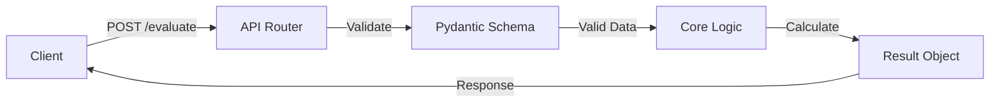

# fast-logic-trainer

思考の「反射神経」と「構造化能力」を定量的に計測・最適化するためのAPI基盤。
非同期処理による低レイテンシな通信と、厳密な型定義を用いたデータ検証を両立させています。

## 1. アーキテクチャと設計思想

本プロジェクトは、保守性と拡張性を最大化するため、以下の3つの原則に基づいて設計されています。

* **責務の分離 (Separation of Concerns)**
  通信処理（API層）、ビジネスロジック（Core層）、データ定義（Schema層）を完全に分離しています。これにより、特定のコンポーネントの変更が他へ波及するリスクを最小化しています。
* **純粋関数によるドメインロジック (Pure Functions)**
  思考スピードのスコアリングを行うコアロジックは、外部状態やI/Oに依存しない純粋関数として実装されています。これにより、エッジケースを含むユニットテストの記述が極めて容易になっています。
* **型安全性の強制 (Type Safety)**
  Pydanticを採用し、クライアントからの入力データおよびシステムからの出力データに対して厳格なバリデーションを適用しています。予期せぬデータ構造によるランタイムエラーを未然に防ぎます。

## 2. システムフロー



## 3. 主要技術スタック
- Web Framework: FastAPI (ASGI)
- Data Validation: Pydantic v2
- Testing: Pytest, HTTPX
- CI/CD: GitHub Actions

## 4. ディレクトリ構成
モジュールごとに名前空間を分離し、ドメインの境界を明確にしています。

```text
├── app/
│   ├── api/          # ルーティングおよびエンドポイント定義
│   ├── core/         # 状態を持たないビジネスロジック
│   ├── schemas/      # Pydanticを用いた入出力の型定義
│   └── main.py       # ASGIアプリケーションのエントリーポイント
├── tests/            # 正常系・異常系を網羅したテストスイート
└── .github/          # CI/CDパイプライン定義
```

## 5. ローカル開発環境の構築手順
依存関係は `requirements.txt` によって固定されており、どの環境でも同一の動作が保証されます。

### セットアップ

```Bash
# 仮想環境の作成と有効化
python -m venv .venv
source .venv/bin/activate  # Windows: .venv\Scripts\activate

# 依存ライブラリのインストール
pip install -r requirements.txt
```

### サーバーの起動
```Bash
uvicorn app.main:app --reload
```

起動後、自動生成されるAPIドキュメント（Swagger UI）には http://127.0.0.1:8000/docs からアクセス可能です。ルートパス（/）へのアクセスは自動的に同ドキュメントへリダイレクトされます。

## 6. 継続的インテグレーション (CI)
GitHub Actionsを利用し、main ブランチへのPushおよびPull Request作成時に、自動的に以下のプロセスが実行されます。

- Python環境のビルド

- 依存パッケージのインストール

- Pytestによる自動テストの実行（HTTPXを用いたルーティングテスト含む）