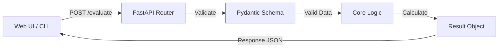

# Fast Logic Trainer

**思考の「反射神経」と「構造化能力」を定量的に計測・最適化するためのトレーニングツール**

FastAPI をベースにした堅牢なバックエンドと、Tailwind CSS を用いたモダンな Web UI、そして `rich` ライブラリを活用した美しい CLI クライアントを備えたフルスタックのポートフォリオプロジェクトです。

---

## 主な特徴

* **🌐 モダンな Web UI**
  * `Tailwind CSS` のグラスモーフィズムデザインによる美しく洗練されたインターフェース。
  * `Web Speech API` を活用し、マイクからの音声入力（文字起こし）による反射神経の計測が可能。
* **💻 リッチな CLI クライアント**
  * ターミナルから直接利用できるクライアントスクリプト (`trainer.py`) を同梱。
  * `rich` パッケージを用いたカラフルなパネル、プロンプト、テーブル表示により、開発者向けの優れたUXを提供。
* **🏛️ 堅固なバックエンドアーキテクチャ**
  * **責務の分離 (Separation of Concerns)**: エンドポイント、ビジネスロジック、設定、データスキーマを完全に分離。
  * **依存性の注入 (Dependency Injection)**: FastAPI の `Depends` をフル活用し、設定や評価ロジックを注入するモック・テスト容易な設計。
  * **データバリデーション**: `Pydantic v2` と `pydantic-settings` を用いた環境変数管理と厳格な型チェック。

---

## 技術スタック

* **Backend**: Python 3, FastAPI, Pydantic, HTTPX
* **Frontend**: HTML5, Vanilla JavaScript, Tailwind CSS (CDN), Web Speech API
* **CLI/TUI**: Rich
* **Testing**: Pytest

---

## 使い方

### 1. セットアップ

```bash
# リポジトリのクローン（または移動）
cd fast-logic-trainer

# 仮想環境の作成と有効化
python -m venv .venv

# Windowsの場合:
.venv\Scripts\activate
# macOS/Linuxの場合:
source .venv/bin/activate

# 依存ライブラリのインストール
pip install -r requirements.txt
```

### 2. サーバーの起動

アプリケーションサーバー（API および Web画面）を起動します。

```bash
uvicorn app.main:app --reload
```

### 3. アプリケーションの利用方法

本システムには **2つのインターフェース** が用意されています。お好みの方法でトレーニングを開始してください。

#### A: 🌐 Web UI (ブラウザで操作)
サーバー起動後、ブラウザで以下のURLにアクセスします。
👉 **[http://127.0.0.1:8000/](http://127.0.0.1:8000/)**

画面の指示に従い、マイクへの音声入力を使って思考のスピードと精度を計測します。

#### B: 💻 CLI クライアント (ターミナルで操作)
サーバーを起動したまま、**別のターミナルウィンドウ**を開き、以下のコマンドを実行します。
（ターミナル上でキーワードをタイピングして計測します）

```bash
python trainer.py
```

---

## ディレクトリ構成

```text
├── app/
│   ├── api/          # ルーティングおよびエンドポイント定義
│   ├── core/         # ビジネスロジック、設定(config.py)、データ定義(topics.py)
│   ├── schemas/      # Pydanticデータモデル (入力/出力の型定義)
│   ├── templates/    # Web UI用のJinja2/HTMLテンプレート
│   └── main.py       # FastAPIアプリケーションのエントリーポイント
├── tests/            # Pytestを用いた自動テストスイート
├── trainer.py        # Richライブラリを用いた強力なCLIクライアント
├── requirements.txt  # 依存パッケージ一覧
└── README.md         # 本ドキュメント
```

---

## システムフロー



---

## テストの実行

プロジェクト内のコード品質を担保するため、Pytest を導入しています。以下のコマンドでテスト群を実行できます。

```bash
python -m pytest tests/
```